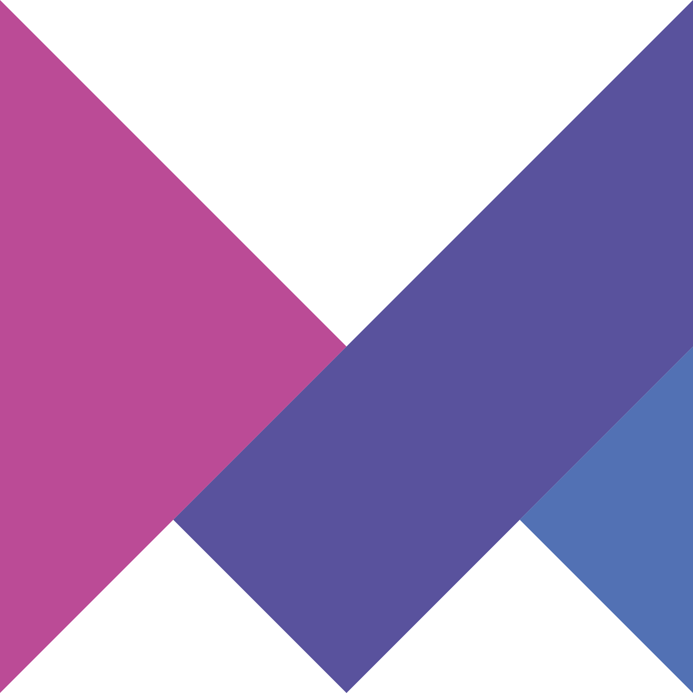
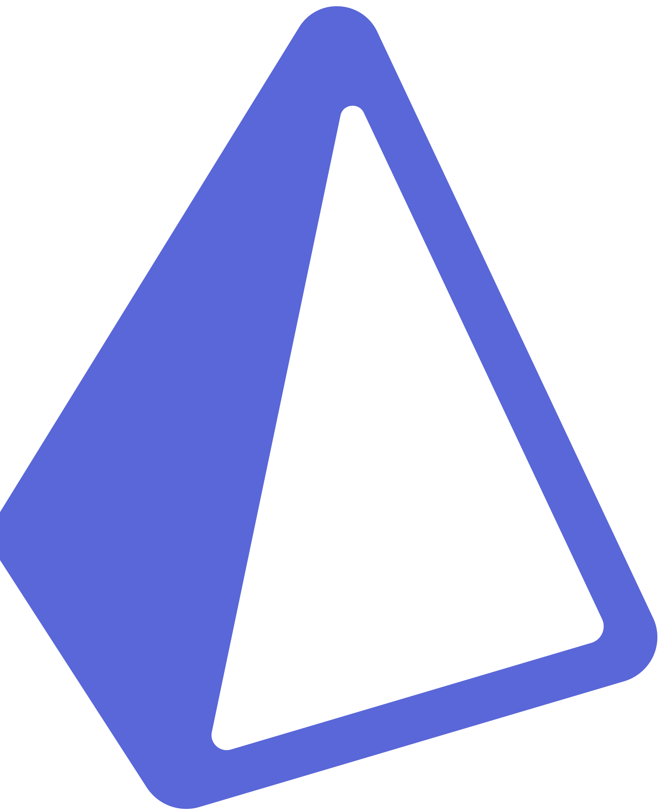

# 🕵🏻‍♂️ Welcome truth-seeker !

Are you looking for a web developer who can bring your wildest ideas to life ? Look no further ! 👋🏼

Based on your needs, timelines, and resources, I will tailor my services to create a project that will impress your visitors.

My commitments include:

- 🎯 Meticulous attention to detail
- 📈 High-performance, optimized, and cross-compatible deliverables
- 🤝 Excellent communication and documentation throughout the project
- 🚀 Time, effort, and budget savings

💩 Don't settle for an average project when you can have the best.

Let's work together ! [📞](tel:+33652789907) [✉️](mailto:contact@rabire.com)

 

---

 

## 🤩 My go-to stack

 

 <!-- handle theme -->

